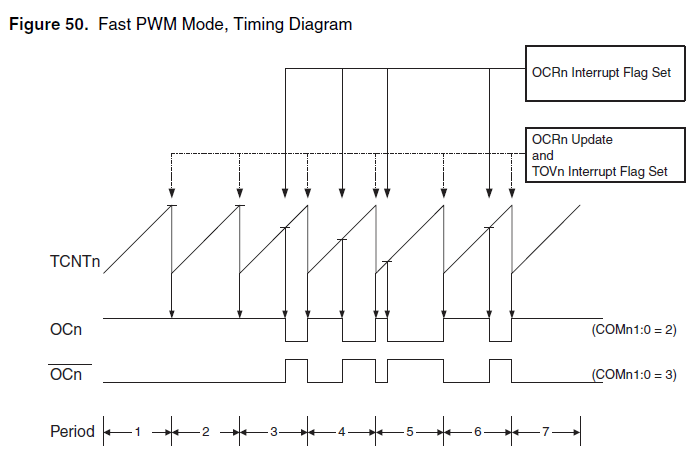
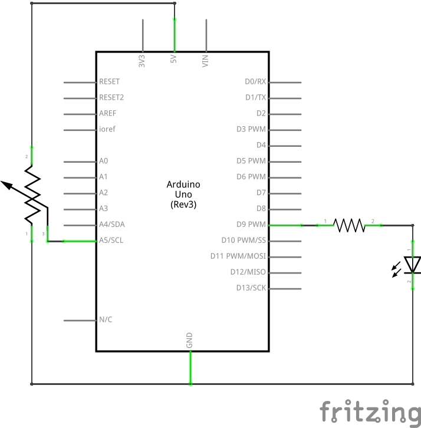
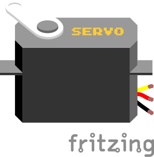
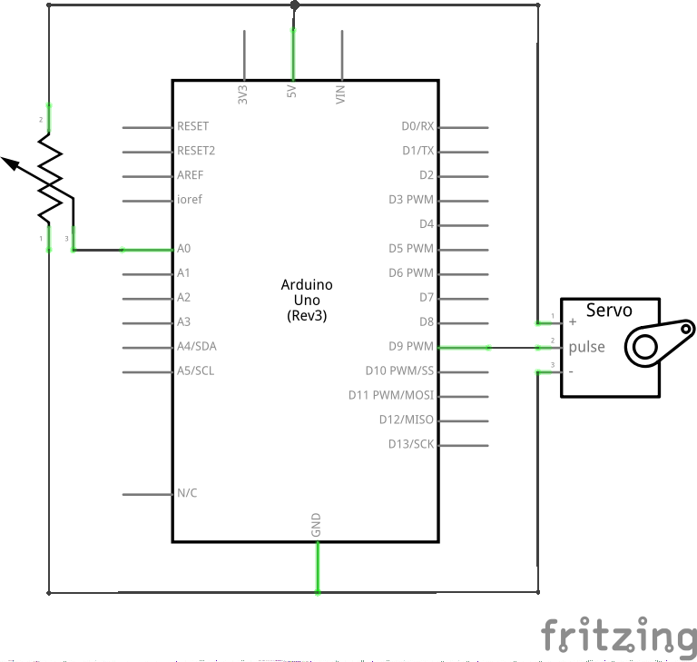
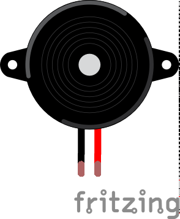

[wakeupcolab](http://www.wakeupcolab.com/)
===================
### mini{curso} de Arduino - jueves 18/12/2014

Por [Wendeurick Silverio](https://twitter.com/obelonave)

Este trabalho está licenciado com uma Licença [Creative Commons - Atribuição 4.0 Internacional](http://creativecommons.org/licenses/by/4.0/).  

  

## AGENDA  
* saídas PWM
* servo-motores
* buzzer
* bate papo

## SAÍDAS PWM
o Arduino possui algumas saídas PWM (modulação por largura de pulso, em inglês).

#### PWM

<p align=center></p>
<br />
<p align=center></p>

* controle de potência
	* ex.: motores
* fontes chaveadas
* lâmpadas de LED

dependendo do modelo e pinos, a frequência do PWM do Arduino é aprox. 490 Hz ou 980 Hz.  

<p align=center></p>

#### comando [analogWrite()](http://arduino.cc/en/Reference/AnalogWrite)
o comando **analogWrite** é usado para o controle do PWM no Arduino. as saídas disponíveis para esta modulação estão indicadas por um til (~).  
sintaxe `analogWrite(pino, valor);`, onde:
* pino: uma das portas de PWM
	- Uno: 3, 5, 6, 9, 10, e 11
* valor: ciclo de trabalho do PWM em 8 bits (0 a 255), sendo
	- 0: 0%
	- 255: 100%
    
exemplo:
```c
// [...]
int pwm = 100;
analogWrite(motor, pwm);
// [...]
analogWrite(led, 200);
```

obs: não é necessário definir o pino como saída quando se for trabalhar somente como saída PWM.

### arquivo [jueves1.ino]()
#### descrição
controla o brilho de um led alto-brilho a partir de um potenciômetro.
* conceitos:
	- PWM

<p align=center></p>

### arquivo [jueves2.ino]()
#### descrição
controla o brilho de um led RGB com o efeito "fade".
* conceitos:
	- LED RGB
    	- pinagem

<p align=center></p>

## SERVO-MOTORES
o servo-motor é um motor que tem sua posição angular definida através de sinal periódico.

<p align=center></p>

**por dentro**
* [pdf](https://www.princeton.edu/~mae412/TEXT/NTRAK2002/292-302.pdf) - pg 9
* [imagem](http://upload.wikimedia.org/wikipedia/commons/9/9c/Inside_a_servo_motor.JPG)
* [imagem](http://winavr.scienceprog.com/sites/default/files/images/stories/2007/Servo/servo3c.jpg)  
  
  
* [especificações do micro servo Tower Pro 9g](http://www.servodatabase.com/servo/towerpro/sg90)
	* [hackeando o micro servo para rotação contínua 360º](http://www.instructables.com/id/How-to-Make-a-TowerPro-Micro-Servo-Spin-360/)

#### sinal
<p align=center></p>

### arquivo [jueves3.ino]()
#### descrição
controla a posição do servo-motor através do potenciômetro.
* conceitos:
	- importar bibliotecas
    - servo-motores

<p align=center></p>

#### diretiva [#include](http://arduino.cc/en/Reference/Include)
a diretiva **include** importa bibliotecas (conjunto de funções e/ou subprogramas) no projeto atual.  
sintaxe `#include <biblioteca>`.  
exemplo: 
```c
#include <Servo.h> // importa a biblioteca Servo.h
```
* [guia de instalação de bibliotecas](http://arduino.cc/en/Guide/Libraries)
	- por que o Arduino é tão difundido?

#### biblioteca [Servo.h](http://arduino.cc/en/Reference/Servo)
a biblioteca **Servo.h**, que já vem com a IDE do Arduino, contém operações que programam o Arduino para trabalhar com servo motores. por exemplo, é ela que configura o período de trabalho de um servo motor (freq. ~50Hz).

usaremos essa biblioteca para declarar objetos da classe Servo e controlar servo-motores através de suas funções.

##### criando objetos da classe Servo
sintaxe `Servo nome;`

##### inicializando um servo motor
sintaxe `nome.attach(pino);`, onde
- 'nome' é um objeto da classe Servo.
- 'pino' é a porta que o servo está conectado
- não é necessário definir o pino como saída

##### posicionando um servo motor
sintaxe `nome.write(angulo);`, onde
- 'nome' é um objeto da classe Servo.
- 'angulo', geralmente de 0 a 180 (depende do servo).

exemplo:
```c
// importa a biblioteca Servo.h
#include <Servo.h>

// cria um objeto chamado 'meuservo'
Servo meuservo;

void setup() {
	// [...]
    // inicializa o servo no pino 9
    meuservo.attach(9);
    // posiciona o servo em 90º
	meuservo.write(90);
    // [...]
}
```

ATENÇÃO: verificar a corrente que cada servo exige da fonte. dependendo dos valores, a porta USB pode não aguentar.

ao importar a biblioteca Servo.h, os pinos 9 e 10 (Uno) estão desabilitados para o comando **analogWrite** (tendo servos conectados a eles ou não).  

## BUZZER

<p align=center></p>

produz um zumbido em resposta a uma frequência.
* com oscilador
* sem oscilador

## LDR

<p align=center></p>

**LDR** (Light Dependent Resistor) é um resistor que tem sua resistência alterada conforme a intensidade de luz sobre si. geralmente sua resisdência diminui à medida que a luminosidade aumenta.  
a forma mais comum de se trabalhar com um LDR e um Arduino é ligar o componente em série com um resistor e captar a variação da tensão (no LDR ou no resistor).

### arquivo [jueves4.ino]()
#### descrição
uma espécie de [Teremim](http://pt.wikipedia.org/wiki/Teremim) de luz. varia a frequência do som conforme a luminosidade.
* conceitos:
	- buzzer
    - tone()
    - ldr
    
<p align=center></p>
#### comando [tone()](http://arduino.cc/en/Reference/Tone)
gera uma onda quadrada (ciclo 50%) em uma determinada frequência e/ou duração.  
sintaxe `tone(pino, frequencia);` ou `tone(pino, frequencia, duracao);`.  
* quando a duração não for especificada, o Arduino tocará a frequência até que o comando [`noTone(pino)`](http://arduino.cc/en/Reference/NoTone) seja chamado.  

exemplo:
```c
#define NOTE_A4  440 // nota La
#define buzzer 8 // pino
// [...]
tone(buzzer, NOTE_A4, 20); // toca a nota La durante 20ms
```

* não é necessário definir o pino como saída.
* [lista das frequências das notas musicais](http://arduino.cc/en/Tutorial/Tone?action=sourceblock&num=2), por  Brett Hagman.
* [cuidado ao ligar o Arduino diretamente aos seus aparelhos de som.](https://code.google.com/p/rogue-code/wiki/ToneLibraryDocumentation)

## BATE PAPO

<br />
<br />
***
> *imagens: [Fritzing](http://fritzing.org/), [Wikimedia](wikimedia.org/) (domínio público), [Ermicro](http://www.ermicro.com/), [Arduino](http://arduino.cc)