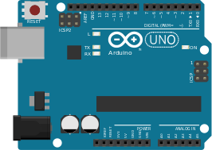
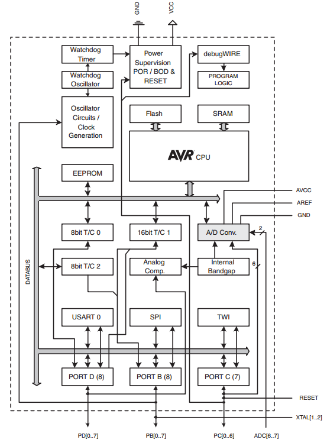
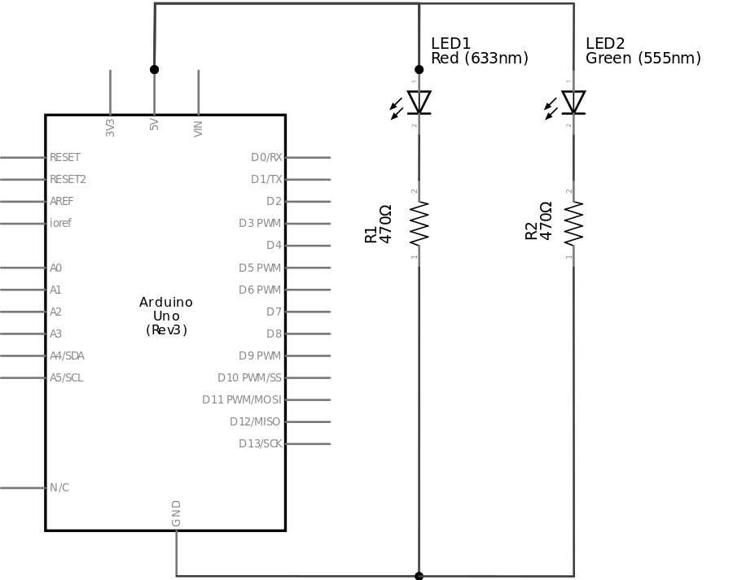
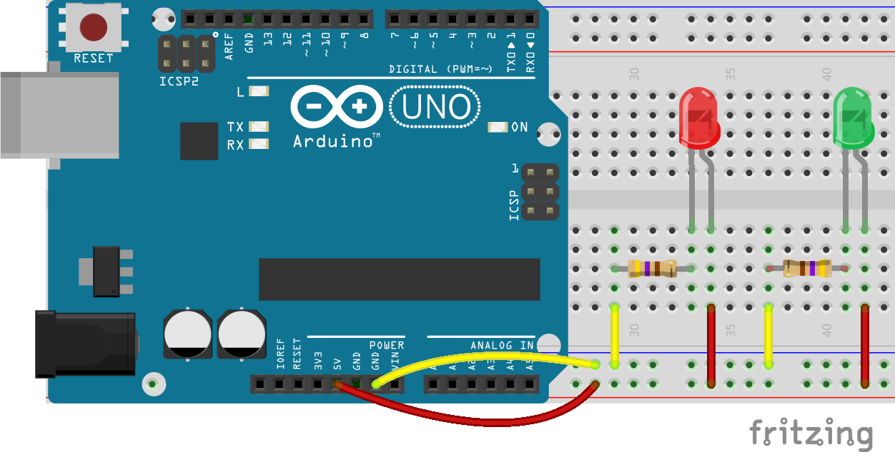
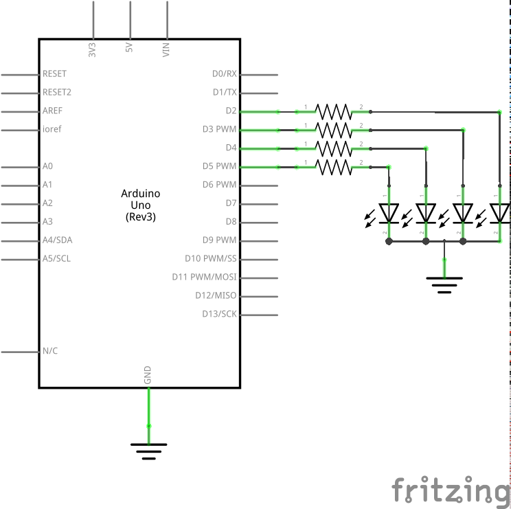
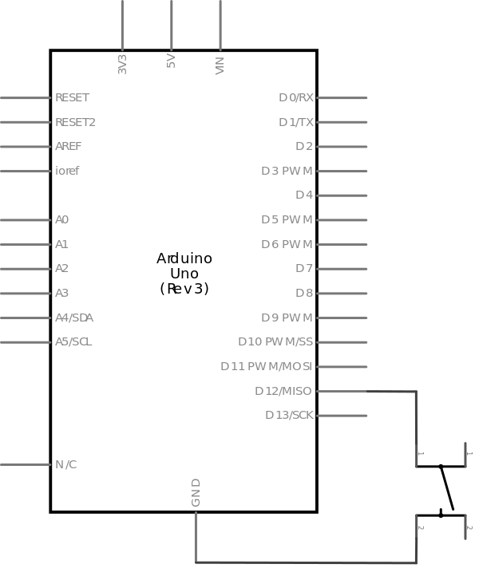
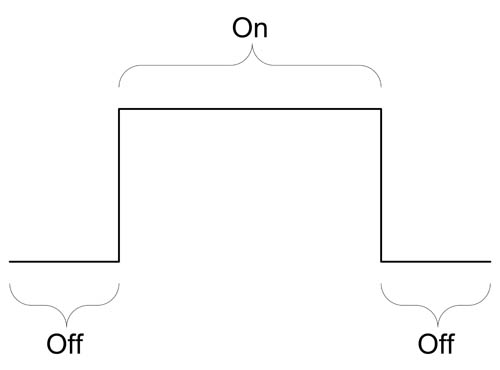
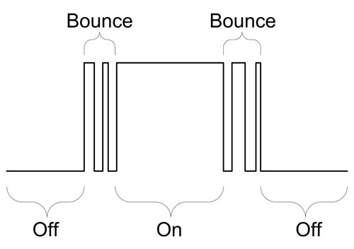

[wakeupcolab](http://www.wakeupcolab.com/)
===================
### mini{curso} de Arduino - martes 16/12/2014

Por [Wendeurick Silverio](https://twitter.com/obelonave)

Este trabalho está licenciado com uma Licença [Creative Commons - Atribuição 4.0 Internacional](http://creativecommons.org/licenses/by/4.0/).  

  

## AGENDA  
* Arduino**s**
* conhecendo a placa Arduino
* conhecendo um datasheet
* diagrama do ATmega328
* Arduino IDE
* conhecendo o esquema elétrico
* conhecendo a placa de protótipo (*protoboard*)
* ligando leds
* lendo botões
* comunicação serial
* bate papo

## ARDUINOS

* [lista de placas, shields, kits e acessórios oficiais](http://arduino.cc/en/Main/Products)

## CONHECENDO A PLACA DO ARDUINO
 
<p align=center></p>

## CONHECENDO UM DATASHEET
* [ATmega328 datasheet](http://www.atmel.com/Images/doc8161.pdf) (pdf) 

## ATMEGA328 DIAGRAMA
<p align=center></p>

## ARDUINO IDE
<p align=center></p>

## CONHECENDO O ESQUEMA ELETRICO
  
<p align=center></p>
  
* alimentação
	* símbolos
* dispositivos
* nós

## CONHECENDO A PROTOBOARD

<p align=center></p>  

* nós

## LIGANDO LEDS

### RESISTOR
* conhecendo o componente
	* função
	* símbolo
	* ~~polaridade~~
	* código de cores

* primeira lei de Ohm
	* `V = R * I`

### DIODO EMISSOR DE LUZ
* conhecendo o componente
	* função
	* símbolo
	* polaridade
	* queda de tensão no led (~ 2V)
	* ligação em série
	
* ligando led na protoboard

<p align=center></p>
  
### arquivo [martes1.ino](martes1/martes1.ino)
> [referência da linguagem Arduino/Wiring](http://arduino.cc/en/Reference/HomePage)

#### descrição
alterna o estado de um led a cada 0,5s.  
* conceitos:
	- funções principais
    - saída digital
    - loop
    - delay

##### função [setup()](http://arduino.cc/en/Reference/Setup)
```c
void setup(){
	// comandos a serem executados somente uma vez
	// comandos de configuração
}
```
a função **setup()** é executada a cada **reset**. devem estar contidos nela os comandos a serem executados somente uma vez. ex.:
* definir os pinos de entrada/saída  
* configurar a velocidade da comunicação serial

veremos mais sobre declaração de funções no decorrer do minicurso.

##### função [loop()](http://arduino.cc/en/Reference/Loop)
```c
void loop(){
	// comandos a serem executados repetidamente
}
```
a função **loop** é executada logo após a função **setup**. devem estar contidos nela os comandos a serem executados repetidamente. ex.:
* monitorar o estado de um sensor
* interação

##### diretiva [#define](http://arduino.cc/en/Reference/Define)
permite que o programa atribua um **nome** a um valor **constante** antes de ser **compilado**.
constantes no arduino "não ocupam memória" - (!= variáveis).  
  
a definição de uma constante é dada pela sintaxe: `#define nome valor`  
exemplo:
```c
#define led    13 // atribui o valor '13' ao nome 'led'
#define botao_1 6 // atribui o valor  '6' ao nome 'botao_1'
#define botaoA  7 // atribui o valor  '7' ao nome 'botaoA'
```
> - o caracter antífen **#** é necessário
- são permitidos somente números, letras (sem caractéres especiais) e subtraços nos nomes   
	- ex.: `#define botão 6`  implica em erro
- nomes de constantes não podem começar com números  
	- ex.: `#define 1botao 6` implica em erro
- a atribuição é feita sem o sinal de `=` e não termina com `;`
	- ex.: `#define botao = 6` implica em erro
	- ex.: `#define botao 6;` implica em erro
	
o Arduino já tem algumas constantes próprias (LOW, HIGH, PI, INPUT, etc), veja a biblioteca [Arduino.h](https://github.com/arduino/Arduino/blob/master/hardware/arduino/cores/arduino/Arduino.h)


##### comando [pinMode()](http://arduino.cc/en/Reference/PinMode)
o comando **pinMode** especifíca se determinado pino será ++entrada++ ou ++saída++ **digital**.
pode ser utilizado em **todos** os pinos do Arduino, inclusive os pinos de entrada analógica (A0 ... A5).
a definição de I/O é dada pela sintaxe: `pinMode(pino, modo);` onde
* pino: **0-13**, **A0-A5** (modelo Uno, por ex.)
* modo: **INPUT**, **OUTPUT**, ou **INPUT_PULLUP**

exemplo:
```c
pinMode(led, OUTPUT); // especifíca o pino 'led' como saída
pinMode(sensor, INPUT);  // especifíca o pino 'sensor' como entrada
pinMode(botao, INPUT_PULLUP);  // especifíca o pino 'botao' como entrada-pullup
```
> * o caracter `;` indica o fim do comando
* camelCase
* os **argumentos** são separados por **vírgula**
* pinMode() é uma função vazia, i.e, não retorna nada. veja em na [definição da função](https://github.com/arduino/Arduino/blob/master/hardware/arduino/cores/arduino/wiring_digital.c).

##### comando [digitalWrite()](http://arduino.cc/en/Reference/DigitalWrite)
o comando **digitalWrite** escreve um valor alto (**HIGH**) ou baixo (**LOW**) em um pino configurado anteriormente como **saída digital**.
pode ser utilizado em **todos** os pinos do Arduino, inclusive nos pinos de entrada analógica (A0 ... A5).
a operação é dada pela sintaxe: `digitalWrite(pino, valor);` onde
* pino: **0-13**, **A0-A5** (modelo Uno, por ex.)
* valor: **HIGH** ou **LOW**

exemplo:
```c
digitalWrite(led1, HIGH); // deixa em nível alto o pino 'led1'
digitalWrite(led2, LOW); // deixa em nível baixo o pino 'led2'
```
> * mesmas considerações sobre o comando pinMode()

##### comando [delay()](http://arduino.cc/en/Reference/Delay)
o comando **delay** "pausa" o programa por um tempo (especificado em **milisegundos**).
a operação é dada pela sintaxe: `delay(tempo);` onde
* tempo: número de milisegundos para a pausa

exemplo:
```c
delay(1000); // aguarda 1000ms = 1s
delay(500); // aguarda 500ms = 0,5s
delay(60000); // aguarda 60000ms = 60s = 1min
```
> * o parâmetro é do tipo [unsigned long](http://arduino.cc/en/Reference/UnsignedLong), i.e, aceita um valor máximo de 4.294.967.295
* ~~este comando deve ser usado com cautela~~
* para tempos inferiores a 1ms, há o comando [delayMicroseconds]((http://arduino.cc/en/Reference/DelayMicroseconds)

### sequencial de LEDs
<p align=center></p>  

* criar um novo sketch e fazer um programa que pisque os LEDs em sequência  

## LENDO BOTOES
### BOTÕES

* conhecendo o componente
	* função
	* símbolo
	* estado
	* ligação

<p align=center></p>
<p align=center></p>

* *LED invertido

### arquivo [martes2.ino](martes2/martes2.ino)

#### descrição
retorna uma mensagem quando o botão é pressionado.
* conceitos
	- entrada digital
    - resistor pull-up
    - princípio de variáveis
    - princípio de estrutura de decisão
    - comunicação serial

#### comunicação serial

**comunicação serial / paralela**  
<p align=center></p>
<p align=center></p>
<p align=center></p>
  
  
##### comando [Serial.begin()](http://arduino.cc/en/Serial/Begin)
define a taxa de transmissão para a comunicação **serial UART**.  
* argumento (bps)
	* 300, 600, 1200, 2400, 4800, **9600**, 14400, 19200, 28800, 38400, 57600, ou 115200
    * particular
* pinos
* dispositivos
* ligação
	* tx -> rx
    * rx -> tx
* conversor USB
* **Serial** é um objeto

##### argumento [INPUT_PULLUP](http://arduino.cc/en/Reference/Constants)
o chip Atmega do Arduino tem resistores *pull-up* internos.
* função
	- substituir resistores pull-up externos :thumbsup:
    - evite usar o pino 13 como entrada
    	- porquê

##### variável [boolean](http://arduino.cc/en/Reference/BooleanVariables)
reserva um espaço da memória e atribui um nome (e um valor) a ela.  
a definição de uma variável é dada pela sintaxe: `tipo nome;` ou `tipo nome = valor;`  
exemplo:
```c
boolean estado; // variável do tipo booleano com nome 'estado'
boolean pisca = true; // variável do tipo booleano com o nome 'pisca' e valor = 'verdadeiro'
boolean trava = false;
```
> - o caracter igual (**=**) indica a atribuição
> - o caracter ponto-e-vírgula (**;**) indica o fim da declaração
> - os nomes das variáveis devem respeitar as mesmas restrições das constantes
> - variáveis do tipo booleano aceitam somente dois tipos de valores:
	* verdadeiro:
    	- true
        - HIGH
        - 1 (lógico / binário)
        - 5 volts (dos pinos)
    * falso:
    	- false
        - LOW
        - 0 (lógico / binário)
        - 0 volt (dos pinos)
* analogia com ligado/desligado, solto/pressionado
* uma vez declarada, só se atribui o valor. exemplo:  

```c  
// [...]
boolean estado = true;
digitalWrite(led, estado);
estado = false; // <---
digitalWrite(led, estado);
```
> - apesar de receber apenas 2 valores, variáveis booleanas ocupam 8 bits da memória.
	- program counter (PC)
> - voltaremos a falar sobre variáveis no decorrer do curso  
    
##### comando [digitalRead()](http://arduino.cc/en/Reference/DigitalRead)
o comando **digitalRead** retorna o valor booleano (verdadeiro ou falso) de um determinado pino configurado anteriormente como **entrada digital**.
pode ser utilizado em **todos** os pinos do Arduino, inclusive nos pinos de entrada analógica (A0 ... A5).
a operação é dada pela sintaxe: `'local de retorno' digitalRead(pino);` onde
* pino: **0-13**, **A0-A5** (modelo Uno, por ex.)
* local de retorno: variável ou argumento de uma função

exemplo:
```c
boolean estado_sensor = digitalRead(sensor);
soma_digitos(!digitalRead(botao));
```

##### comando [if()](http://arduino.cc/en/Reference/DigitalRead)
o comando **if** faz parte das **estruturas de controle** (veremos outras no decorrer do curso). ele é usado para testar condições. o programa executará seu escopo caso a condição seja **verdadeira**.
a operação é dada pela sintaxe: `if(condicao e comparacao){/*escopo*/}` onde
* condição: aquilo a ser verificado
* escopo: rotina a ser executada caso a(s) condição seja verdadeira
* comparação: ver próximo tópico

**operadores de comparação**
- x == y: (x igual a y)
- x != y: (x diferente de y)
- x <  y: (x menor que y)
- x >  y: (x maior que y)
- x <= y: (x menor ou igual a y)
- x >= y: (x maior ou igual a y)  
  

veremos como relacionar operadores booleanos no decorrer do curso
	
##### comando [Serial.print()](http://arduino.cc/en/Serial/Print)
escreve um (ou mais) caracteres [ASCII](http://www.asciitable.com/) no pino TX.
exemplo:
```c
Serial.print(3); // escreve '3' (em ASCII)
int tempo = 15;
Serial.print(tempo); // escreve '1', depois '5' (em ASCII)
Serial.print("Ola, mundo.\n"); // escreve a frase e depois pula uma linha
Serial.println("Ola, mundo."); // escreve a frase e depois pula uma linha
```
uma sequência de caracteres também é chamada de [string](http://arduino.cc/en/Reference/String) (e são definidas dentro de aspas duplas).
### arquivo [martes3.ino](martes3/martes3.ino)

#### descrição
incrementa o contador toda vez que o botão é pressionado.
* conceitos
	- variáveis globais
    - operações aritméticas
    - estrutura de repetição while()
    - técnica de debouncing via software

#### variável [int](http://arduino.cc/en/Reference/Int)
reserva um espaço da memória (2 bytes) e atribui um nome (e um valor) a ela.  
enquanto variáveis do tipo booleano aceitam somentes valores **verdadeiro** e **falso**, variáveis do tipo **int**eiro aceitam valores numéricos entre
**-32.768** to **32.767**.  
exemplo:
```c
int tempMin = -3;
int tempMax = 21;
```
> - para números maiores que 32.767
	- [unsigned int](http://arduino.cc/en/Reference/UnsignedInt): **0** a **65.535**
    - [long](http://arduino.cc/en/Reference/Long): **-2.147.483.648** a **2.147.483.647**
    - [unsigned long](http://arduino.cc/en/Reference/UnsignedLong): **0** a **4.294.967.295**

- [operadores aritméticos](http://arduino.cc/en/Reference/Arithmetic)
	- **+** (adição)
	- **-** (subtração)
	- ***** (multiplicação)
	- **/** (divisão)
	- **%** (resto)  

exemplo:  
```c
int a = 2, b = 5;

int soma = a + b + 3; // soma: 10
int sub = b - a; // sub: 3
sub = a - b; // sub: -3
int mult = 1 + a * b; // mult: 11
mult = (1 + a) * b; // mult: 15
int div = b / a; // div: 2
div = a / b; // div: 0
int resto = b % a; // resto: 1
resto = a % b; // resto: 2
```  

- [operadores compostos](http://arduino.cc/en/Reference/IncrementCompound)
	- **++** [(incremento)](http://arduino.cc/en/Reference/Increment)
	- **--** [(decremento)](http://arduino.cc/en/Reference/Increment)
	- **+=** (adição composta)
	- **-=** (subtração composta)
	- ***=** (multiplicação composta)
	- **/=** (divisão composta)
	- **&=** (E composto)
	- **|=** (OU composto)  

exemplo:  
- a = 2, b = 5
	- `a++` -> a: 3
	- `b--` -> b: 4
	- `a += 2` -> a: 4
	- `b -= 2` -> b: 3
	- `b *= 4` -> b: 20
	- `a /= 2` -> a: 1
	- `b = a++` -> b: 2, a: 3
	- `b = ++a` -> a: 3, b: 3
 
    
#### variáveis globais
uma variável global existe durante toda a execução do programa e pode ser acessada por qualquer função. já uma variável local existe somente durante a execução do seu **escopo** (isso permite uma economia de memória) e não é acessível para outros blocos/funções (veremos mais sobre variáveis locais no decorrer do curso).  
variáveis globais geralmente são usadas quando se deseja acessá-las de qualquer lugar ou então não perder seu valor ao final de um escopo ou laço.  

- sua declaração deve vir antes de sua chamada

exemplo:
```c
// [...]
int contador; // declaracao da variavel

void setup(){
    // [...]
    contador = 0;
}

void loop(){
    contador++;
    // [...]
}
```
contra exemplo:
```c
void setup(){
    // [...]
    contador = 0;  // error: ‘contador’ was not declared in this scope
}

int contador; // declaracao da variavel

void loop(){
    contador++;
    // [...]
}
```

#### operador booleano [! (not)](http://arduino.cc/en/Reference/Boolean)
inverte o estado do operando.
- **!true** é equivalente a **false**
- **!false** é equivalente a **true**  

esta operação é bastante útil quando trabalhamos com entradas pull-up.  
 - `if(digitalRead(botao) == LOW)` é equivalente a `if(!digitalRead(botao))` 
 	- o escopo '**{}**' do **if()** só é executado quando a condição dos operadores for **verdadeira**.
    - digitalRead(botao) -> **false**: botão pressionado
    - !digitalRead(botao) -> **true**: botão pressionado
    - digitalRead(botao) -> **true**: botão não pressionado
    - !digitalRead(botao) -> **false**: botão não pressionado
    
#### laço [while()](http://arduino.cc/en/Reference/While)
permanece em loop enquanto sua expressão for **verdadeira**.  
exemplo:
```c
// [...]
while(dalmatas <= 100){
	dalmatas++;
}
// sai do laco quando dalmatas chegar a 101
```

#### DEBOUNCING
##### contato ideal
<p align=center></p>  
<br />
##### contato real
<p align=center></p>

* uma das técnicas de debouncing via software é
	- aguardar 5ms
	- aguardar a mudança de estado (loop)
	- aguardar mais 5ms

exemplo:  
```c
se(botaoPressionado()){
	// [...]
	aguarda_5ms();
	enquanto(botaoPressionado());
	aguarda_5ms();
}
```
exemplo Arduino:
```c
// verifica se o botao foi pressionado
if(!digitalRead(botao)){
	// [...]
	
	delay(5); // aguarda 5ms
	while(!digitalRead(botao)); // fica em laco ate o botao ser solto (voltar ao nivel alto) (!HIGH = LOW = false)
	delay(5); // aguarda 5ms
}

```
## BATE PAPO
<br />
<br />
***
> *imagens: [Fritzing](http://fritzing.org/), [Sparkfun](https://learn.sparkfun.com/tutorials/serial-communication), [Protostack](http://www.protostack.com/blog/2010/03/debouncing-a-switch/)