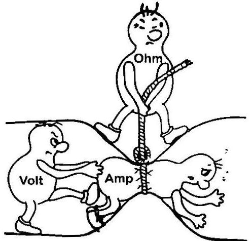
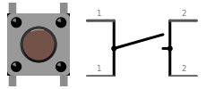
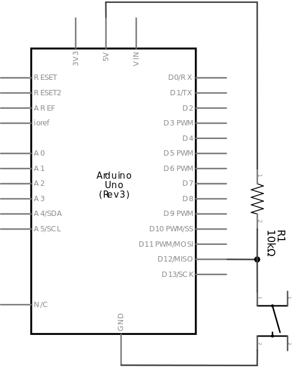
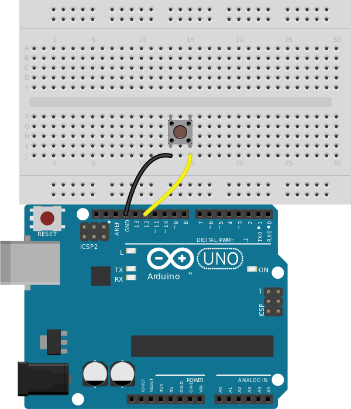

[wakeupcolab](http://www.wakeupcolab.com/)
===================
### mini{curso} de Arduino - martes 16/12/2014

Por [Wendeurick Silverio](https://twitter.com/obelonave)

Este trabalho está licenciado com uma Licença [Creative Commons - Atribuição 4.0 Internacional](http://creativecommons.org/licenses/by/4.0/).  

  

## AGENDA  
* Arduino**s**
* Conhecendo a placa Arduino
* Conhecendo um datasheet
* Diagrama do ATmega328
* Arduino IDE
* Conhecendo o esquema elétrico
* Conhecendo a placa de protótipo (*protoboard*)
* Ligando leds
* Lendo botões
* Comunicação serial
* Bate papo

## ARDUINOS

* [Lista de placas, shields, kits e acessórios oficiais](http://arduino.cc/en/Main/Products)

## CONHECENDO A PLACA DO ARDUINO
* Identificando os componentes  
</br>
</br>
<p align=center></p>

## CONHECENDO UM DATASHEET
* [ATmega328 datasheet](http://www.atmel.com/Images/doc8161.pdf) (pdf)

## ATMEGA328 DIAGRAMA
<p align=center></p>

## ARDUINO IDE
<p align=center></p>

## CONHECENDO O ESQUEMA ELETRICO
* Identificando a alimentação, dispositivos e nós
</br>
</br>  
<p align=center></p>

## CONHECENDO A PROTOBOARD
* Identificando trilhas e nós
</br>
</br>
<p align=center></p>  

## LIGANDO LEDS

### RESISTOR
Resumidamente, resistores são usados para controlar a corrente elétrica e com isso obter queda de tensão.
* Conhecendo o componente
	- Símbolo
	- Código de cores
	- ~~Polaridade~~

<p align=center></p>
<p align=center></p>

* Primeira lei de Ohm
	* `V = R * I`, onde
		- V: tensão [Volt: V]
		- R: resistência [Ohm]
		- I: corrente [Ampere: A]
</br>
</br>
<p align=center></p>

### DIODO EMISSOR DE LUZ
* Conhecendo o componente
	* Função
	* Símbolo
	* Polaridade
		- Por ser um diodo, os LEDs acendem somente em um sentido (com exceção dos LEDs bipolares). Em seu funcionamento comum, o sentido da corrente é anodo -> catodo.
		- Geralmente o catodo do LED é a parte que tem um chanfro (com exceção do LED RGB de 4 terminais - na dúvida, consulte o datasheet):
			- na imagem abaixo, esquerda, o chanfro está do lado esquerdo
			- na imagem abaixo, direita, o catodo é o pino de baixo (pino 2)
<p align=center></p>
		- Nem sempre o maior terminal é o catodo.
	* Queda de tensão no led (~ 2V)
		- Todo diodo tem uma queda de tensão ao ser polarizado. Essa queda tensão varia conforme a cor do LED.
	* Corrente
		- A corrente de um LED varia de acordo com a cor, tipo, fabricante, etc.
		- Vamos aproximar para ~10mA
	* Ligação em série
		- Geralmente se usa um resistor em série para controlar a corrente de um LED (veja no tópico anterior "CONHECENDO O ESQUEMA ELETRICO"). Como estamos interessados somente na **corrente** do LED, tanto faz o resistor estar antes ou depois do LED nesta série.
	* Exemplo do cálculo de resistor para um LED com uma alimentação de 5V:
		- Da Primeira Lei de Ohm, temos que:
			- `V = R * I` -> `R = V / I`, onde:
				- R: valor do resistor
				- V: queda de tensão no resistor
				- I: corrente da série (corrente do LED)
		- Neste exemplo, a alimentação (Vcc) é 5V:
			- `Vresistor = Vcc - Vled` -> `Vresistor = 5 - 2 = 3V`
		- Substituindo os valores
			- `R = 3 / 10m` = `300 ohm`
			- O valor comercial recomendado é **330 ohm**

* Ligando led na protoboard

<p align=center></p>

**A placa Arduino Uno tem um led conectado ao pino 13.**

### arquivo [martes1.ino](https://github.com/wsilverio/arduino-wakeupcolab-diciembre-2014/blob/master/martes/martes1/martes1.ino)
> [referência da linguagem Arduino/Wiring](http://arduino.cc/en/Reference/HomePage)

#### descrição
Alterna o estado de um led a cada 0,5s.  
* Conceitos:
	- funções principais
    - saída digital
    - loop
    - delay

##### função [setup()](http://arduino.cc/en/Reference/Setup)
```c
void setup(){
	// comandos a serem executados somente uma vez
	// comandos de configuração
}
```
A função **setup()** é executada a cada **reset**. Devem estar contidos nela os comandos a serem executados somente uma vez. Ex.:
* Definir os pinos de entrada/saída  
* Configurar a velocidade da comunicação serial

A palavra **void** indica que a função não retorna nenhum valor. Isto ficará claro mais pra frente, quando vermos mais sobre declaração de funções no decorrer do minicurso.

##### função [loop()](http://arduino.cc/en/Reference/Loop)
```c
void loop(){
	// comandos a serem executados repetidamente
}
```
A função **loop** é executada logo após a função **setup**. Devem estar contidos nela os comandos a serem executados repetidamente. Ex.:
* Monitorar o estado de um sensor
* Interação

##### diretiva [#define](http://arduino.cc/en/Reference/Define)
Permite que o programa atribua um **nome** a um valor **constante** antes de ser **compilado**.  
Constantes no arduino "não ocupam memória" - (!= variáveis).  

A definição de uma constante é dada pela sintaxe: `#define nome valor`  
Exemplo:
```c
#define led    13 // atribui o valor '13' ao nome 'led'
#define botao_1 6 // atribui o valor  '6' ao nome 'botao_1'
#define botaoA  7 // atribui o valor  '7' ao nome 'botaoA'
```
> - O caracter antífen **#** é necessário
- São permitidos somente números, letras (sem caractéres especiais) e subtraços nos nomes
	- ex.: `#define botão 6`  implica em erro
- Nomes de constantes não podem começar com números  
	- ex.: `#define 1botao 6` implica em erro
- A atribuição é feita sem o sinal de `=` e não termina com `;`
	- ex.: `#define botao = 6` implica em erro
	- ex.: `#define botao 6;` implica em erro

O Arduino já tem algumas constantes próprias (LOW, HIGH, PI, INPUT, etc), veja a biblioteca [Arduino.h](https://github.com/arduino/Arduino/blob/master/hardware/arduino/cores/arduino/Arduino.h)


##### comando [pinMode()](http://arduino.cc/en/Reference/PinMode)
O comando **pinMode** especifíca se determinado pino será ++entrada++ ou ++saída++ **digital**.  
Pode ser utilizado em **todos** os pinos do Arduino, inclusive os pinos de entrada analógica (A0 ... A5) quando utilizados como pinos digitais.  
A definição de I/O é dada pela sintaxe: `pinMode(pino, modo);` onde
* `pino`: **0-13**, **A0-A5** (modelo Uno, por ex.)
* `modo`: **INPUT**, **OUTPUT**, ou **INPUT_PULLUP**

Exemplo:
```c
pinMode(led, OUTPUT); // especifíca o pino 'led' como saída
pinMode(sensor, INPUT);  // especifíca o pino 'sensor' como entrada
pinMode(botao, INPUT_PULLUP);  // especifíca o pino 'botao' como entrada-pullup
```
> * O caracter `;` indica o fim do comando
* camelCase
* Os **argumentos** são separados por **vírgula**
* pinMode() é uma função vazia, i.e, não retorna nada. Veja em na [definição da função](https://github.com/arduino/Arduino/blob/master/hardware/arduino/cores/arduino/wiring_digital.c).

##### comando [digitalWrite()](http://arduino.cc/en/Reference/DigitalWrite)
O comando **digitalWrite** escreve um valor alto (**HIGH**) ou baixo (**LOW**) em um pino configurado anteriormente como **saída digital**.  
Pode ser utilizado em **todos** os pinos do Arduino, inclusive nos pinos de entrada analógica (A0 ... A5).  
A operação é dada pela sintaxe: `digitalWrite(pino, valor);` onde
* pino: **0-13**, **A0-A5** (modelo Uno, por ex.)
* valor: **HIGH** ou **LOW**

Exemplo:
```c
digitalWrite(led1, HIGH); // deixa em nível alto o pino 'led1'
digitalWrite(led2, LOW); // deixa em nível baixo o pino 'led2'
```
> * mesmas considerações sobre o comando pinMode()

##### comando [delay()](http://arduino.cc/en/Reference/Delay)
O comando **delay** "pausa" o programa por um tempo (especificado em **milisegundos**).  
A operação é dada pela sintaxe: `delay(tempo);` onde
* `tempo`: número de milisegundos para a pausa

Exemplo:
```c
delay(1000); // aguarda 1000ms = 1s
delay(500); // aguarda 500ms = 0,5s
delay(60000); // aguarda 60000ms = 60s = 1min
```
> * O parâmetro é do tipo [unsigned long](http://arduino.cc/en/Reference/UnsignedLong), i.e, aceita um valor máximo de 4.294.967.295
* ~~Este comando deve ser usado com cautela~~
* Para tempos inferiores a 1ms, há o comando [delayMicroseconds](http://arduino.cc/en/Reference/DelayMicroseconds)

## [martes_extra](https://github.com/wsilverio/arduino-wakeupcolab-diciembre-2014/blob/master/martes/martes_extra/): sequencial de LEDs
* Criar um novo sketch que pisque os LEDs em sequência  

## LENDO BOTOES
### BOTÕES
</br>
<p align=center></p>  
<p align=center></p>

* Conhecendo o componente
	* Função
	* Símbolo
	* Estado
		- Há 2 tipos primitivos de botão
			- Normalmente Aberto (NA)
				- Fecha o contado ao ser pressionado
					- imagem abaixo
			- Normalmente Fechado (NF)
				- Abre o contado ao ser pressionado
	* Ligação
		- No exemplo abaixo, o botão permite que o Arduino "enxergue", pelo pino 12, 5V (botão solto) e 0V (botão presionado).
		- A função do resistor, neste caso, é evitar que se dê curto-circuito entre o 5V e o Terra ao pressionar o botão. Como estamos interessados somente no valor a tensão, podemos colocar um resistor alto (~10k Ohm).
		- O Arduino já tem um resistor interno (resistor pull-up) para esses casos.

<p align=center></p>

### arquivo [martes2.ino](https://github.com/wsilverio/arduino-wakeupcolab-diciembre-2014/blob/master/martes/martes2/martes2.ino)

#### descrição
Retorna uma mensagem quando o botão é pressionado.

<p align=center></p>
<p align=center></p>

</br>
* Conceitos
	- Entrada digital
    - Resistor pull-up
    - Princípio de variáveis
    - Princípio de estrutura de decisão
    - Comunicação serial

#### comunicação serial
É um tipo de comunicação que transmite (e/ou recebe) um bit por vez, no estilo **trem de pulso**. Ocupam poucos fios (gerlamente são 2 fios para troca de informação).  
<p align=center></p>

Já a comunicação paralela envia a informação com todos os bits de uma vez, com isso, ocupa mais vias de transmissão.
<p align=center></p>

##### comando [Serial.begin()](http://arduino.cc/en/Serial/Begin)
Define a taxa de transmissão para a comunicação **serial UART**.  
* Argumento (bps)
	* 300, 600, 1200, 2400, 4800, **9600**, 14400, 19200, 28800, 38400, 57600, ou 115200
    * particular
* Pinos
	- Arduino Uno:
    	- TX: pino 1
        - RX: pino 0
* Dispositivos
	- GPS, GSM, Bluetooth
* Ligação
	* TX -> RX
    * RX -> TX
* Conversor USB
	- A maioria das placas Arduino contém um conversor USB. Isso permite trocar informações com o computador, como faremos no exemplo `martes2.ino`
* **Serial** é um objeto
	- se você não conhece programação orientada a objetos, esta não é uma informação relevante até então.

##### argumento [INPUT_PULLUP](http://arduino.cc/en/Reference/Constants)
O chip Atmega do Arduino tem resistores *pull-up* internos.
* Função
	- substituir resistores pull-up externos :thumbsup:

* [**Evite usar o pino 13 como entrada**](http://arduino.cc/en/Tutorial/DigitalPins)

##### variável [boolean](http://arduino.cc/en/Reference/BooleanVariables)
Reserva um espaço da memória e atribui um nome (e um valor) a ela.  
A definição de uma variável é dada pela sintaxe: `tipo nome;` ou `tipo nome = valor;`  
Exemplo:
```c
boolean estado; // variável do tipo booleano com nome 'estado'
boolean pisca = true; // variável do tipo booleano com o nome 'pisca' e valor = 'verdadeiro'
boolean trava = false;
```
> - O caracter igual (**=**) indica a atribuição
> - O caracter ponto-e-vírgula (**;**) indica o fim da declaração
> - Os nomes das variáveis devem respeitar as mesmas restrições das constantes
> - Variáveis do tipo booleano aceitam somente dois tipos de valores:
	* verdadeiro:
    	- true
        - HIGH
        - 1 (lógico / binário)
        - 5 volts (dos pinos)
    * falso:
    	- false
        - LOW
        - 0 (lógico / binário)
        - 0 volt (dos pinos)
* Analogia com ligado/desligado, solto/pressionado
* Uma vez declarada, só se atribui o valor. exemplo:  

```c  
// [...]
boolean estado = true;
digitalWrite(led, estado);
estado = false; // <---
digitalWrite(led, estado);
```
> - Apesar de receber apenas 2 valores, variáveis booleanas ocupam 8 bits da memória.
	- program counter (PC)
> - Voltaremos a falar sobre variáveis no decorrer do curso  

##### comando [digitalRead()](http://arduino.cc/en/Reference/DigitalRead)
O comando **digitalRead** retorna o valor booleano (verdadeiro ou falso) de um determinado pino configurado anteriormente como **entrada digital**.  
Pode ser utilizado em **todos** os pinos do Arduino, inclusive nos pinos de entrada analógica (A0 ... A5).  
A operação é dada pela sintaxe: `'local de retorno' digitalRead(pino);` onde
* `pino`: **0-13**, **A0-A5** (modelo Uno, por ex.)
* `local de retorno`: variável ou argumento de uma função

Exemplo:
```c
boolean estado_sensor = digitalRead(sensor);
soma_digitos(!digitalRead(botao));
```

##### comando [if()](http://arduino.cc/en/Reference/DigitalRead)
O comando **if** faz parte das **estruturas de controle** (veremos outras no decorrer do curso). Ele é usado para testar condições. O programa executará seu corpo caso a condição seja **verdadeira**.  
A operação é dada pela sintaxe: `if(condicao e comparacao){/*escopo*/}` onde
* `condição`: aquilo a ser verificado
* `escopo`: rotina a ser executada caso a(s) condição seja verdadeira
* `comparação`: ver próximo tópico

**operadores de comparação**
- **x == y**: (x igual a y)
- **x != y**: (x diferente de y)
- **x <  y**: (x menor que y)
- **x >  y**: (x maior que y)
- **x <= y**: (x menor ou igual a y)
- **x >= y**: (x maior ou igual a y)  

Exemplo:
```c
boolean estado = digitalRead(botao);
if(estado == LOW){
	// acende o led se o estado do botao for LOW
	digitalWrite(led, HIGH);
}
```

##### comando [Serial.print()](http://arduino.cc/en/Serial/Print)
Escreve um (ou mais) caracteres [ASCII](http://www.asciitable.com/) no pino TX.  
Exemplo:
```c
Serial.print(3); // escreve '3' (em ASCII)
int tempo = 15;
Serial.print(tempo); // escreve '1', depois '5' (em ASCII)
Serial.print("Ola, mundo.\n"); // escreve a frase e depois pula uma linha
Serial.println("Ola, mundo."); // escreve a frase e depois pula uma linha
```
Uma sequência de caracteres também é chamada de [string](http://arduino.cc/en/Reference/String) (e são definidas dentro de aspas duplas).
### arquivo [martes3.ino](https://github.com/wsilverio/arduino-wakeupcolab-diciembre-2014/blob/master/martes/martes3/martes3.ino)

#### descrição
Incrementa o contador toda vez que o botão é pressionado.

<p align=center></p>
<p align=center></p>

* Conceitos
	- Variáveis globais
    - Operações aritméticas
    - Estrutura de repetição while()
    - Técnica de debouncing via software

#### variável [int](http://arduino.cc/en/Reference/Int)
Reserva um espaço da memória (2 bytes) e atribui um nome (e um valor) a ela.  
Enquanto variáveis do tipo booleano aceitam somentes valores **verdadeiro** e **falso**, variáveis do tipo **int**eiro aceitam valores numéricos entre
**-32.768** to **32.767**.  
Exemplo:
```c
int tempMin = -3;
int tempMax = 21;
```
> - Para números maiores que 32.767
	- [unsigned int](http://arduino.cc/en/Reference/UnsignedInt): **0** a **65.535**
    - [long](http://arduino.cc/en/Reference/Long): **-2.147.483.648** a **2.147.483.647**
    - [unsigned long](http://arduino.cc/en/Reference/UnsignedLong): **0** a **4.294.967.295**

- [Operadores aritméticos](http://arduino.cc/en/Reference/Arithmetic)
	- **+** (adição)
	- **-** (subtração)
	- * (multiplicação)
	- **/** (divisão)
	- **%** (resto)  

Exemplo:  
```c
int a = 2, b = 5;

int soma = a + b + 3; // soma: 10
int sub = b - a; // sub: 3
sub = a - b; // sub: -3
int mult = 1 + a * b; // mult: 11 (prioridade da multiplicacao)
mult = (1 + a) * b; // mult: 15
int div = b / a; // div: 2
div = a / b; // div: 0
int resto = b % a; // resto: 1
resto = a % b; // resto: 2
```  

- [Operadores compostos](http://arduino.cc/en/Reference/IncrementCompound)
	- **++** [(incremento)](http://arduino.cc/en/Reference/Increment)
	- **--** [(decremento)](http://arduino.cc/en/Reference/Increment)
	- **+=** (adição composta)
	- **-=** (subtração composta)
	- *= (multiplicação composta)
	- **/=** (divisão composta)
	- **&=** (E composto)
	- **|=** (OU composto)  

Exemplo:  
- a = 2, b = 5
	- `a++` -> a: 3 (o mesmo que `a = a + 1`)
	- `b--` -> b: 4 (o mesmo que `b = b - 1`)
	- `a += 2` -> a: 4 (o mesmo que `a = a + 2`)
	- `b -= 2` -> b: 3 (o mesmo que `b = b - 2`)
	- `b *= 4` -> b: 20 (o mesmo que `b = b * 4`)
	- `a /= 2` -> a: 1 (o mesmo que `a = a / 2`)
	- `b = a++` -> b: 2, a: 3 (o mesmo que `b = a` e depois `a = a + 1`)
	- `b = ++a` -> a: 3, b: 3 (o mesmo que `a = a + 1` e depois `b = a`)

É importante destacar que em operações entre inteiros, o resultado também é um número inteiro:
```c
int a = 2, b = 5;
int div = b / a; // div: 2, e nao 2.5
```

#### variáveis globais
Uma variável global existe durante toda a execução do programa e pode ser acessada por qualquer função. Já uma variável local existe somente durante a execução do seu **escopo** (isso permite uma economia de memória), porém e não é acessível para outros blocos/funções (veremos mais sobre variáveis locais no decorrer do curso).  
Variáveis globais geralmente são usadas quando se deseja acessá-las de qualquer lugar ou então não perder seu valor ao final de um escopo ou laço.  

- Sua declaração deve vir antes de sua chamada

Exemplo:
```c
// [...]
int contador; // declaracao da variavel

void setup(){
    // [...]
    contador = 0;
}

void loop(){
    contador++;
    // [...]
}
```
Contra exemplo:
```c
void setup(){
    // [...]
    contador = 0;  // error: ‘contador’ was not declared in this scope
}

int contador; // declaracao da variavel

void loop(){
    contador++;
    // [...]
}
```

#### operador booleano [! (not)](http://arduino.cc/en/Reference/Boolean)
Inverte o estado do operando.
- **!true** é equivalente a **false**
- **!false** é equivalente a **true**  

Esta operação é bastante útil quando trabalhamos com entradas pull-up.  
 - `if(digitalRead(botao) == LOW)` é equivalente a `if(!digitalRead(botao))`
 	- O escopo '**{}**' do **if()** só é executado quando a condição dos operadores for **verdadeira**.
    - digitalRead(botao) -> **false**: botão pressionado
    - !digitalRead(botao) -> **true**: botão pressionado
    - digitalRead(botao) -> **true**: botão não pressionado
    - !digitalRead(botao) -> **false**: botão não pressionado

#### laço [while()](http://arduino.cc/en/Reference/While)
Permanece em loop enquanto sua expressão for **verdadeira**.  
Exemplo:
```c
// [...]
while(dalmatas <= 100){
	dalmatas++;
}
// sai do laco quando dalmatas chegar a 101
```

#### DEBOUNCING
##### contato ideal de uma chave

<p align=center></p>  

##### contato real

<p align=center></p>

* Uma das técnicas de debouncing via software é
	- aguardar 5ms
	- aguardar a mudança de estado (loop)
	- aguardar mais 5ms

Exemplo:  
```c
se(botaoPressionado()){
	// [...]
	aguarda_5ms();
	enquanto(botaoPressionado());
	aguarda_5ms();
}
```
Exemplo Arduino:
```c
// verifica se o botao foi pressionado
if(!digitalRead(botao)){
	// inverte o estado do led
    digitalWrite(led, !digitalRead(led));

    // debouncing
	delay(5); // aguarda 5ms
	while(!digitalRead(botao)); // fica em laco ate o botao ser solto (voltar ao nivel alto) (!HIGH = LOW = false)
	delay(5); // aguarda mais 5ms
}

```
## BATE PAPO
<br />
<br />
***
> *imagens: [Fritzing](http://fritzing.org/), [Sparkfun](https://learn.sparkfun.com/tutorials/serial-communication), [Protostack](http://www.protostack.com/blog/2010/03/debouncing-a-switch/)
