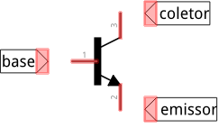
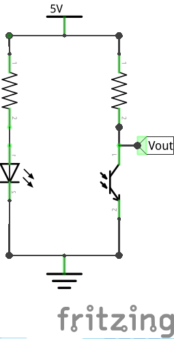
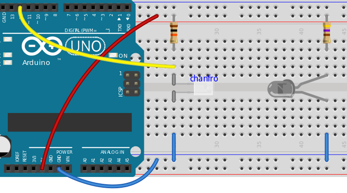
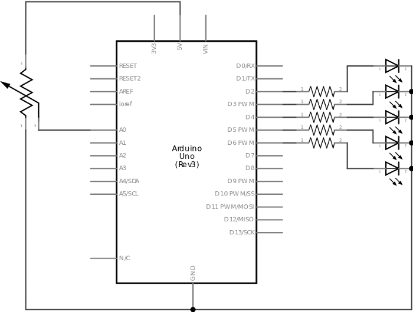
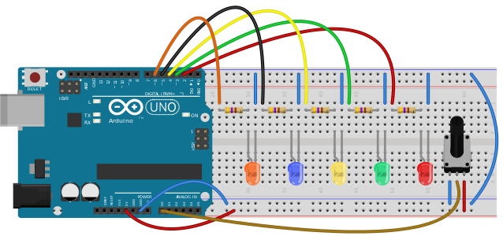
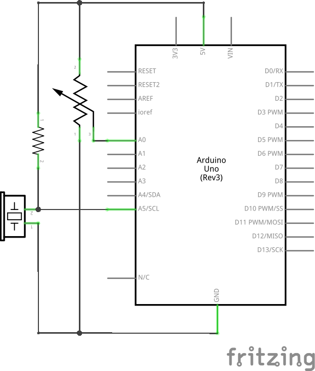

[wakeupcolab](http://www.wakeupcolab.com/)
===================
### mini{curso} de Arduino - miércoles 17/12/2014

Por [Wendeurick Silverio](https://twitter.com/obelonave)

Este trabalho está licenciado com uma Licença [Creative Commons - Atribuição 4.0 Internacional](http://creativecommons.org/licenses/by/4.0/).  

  

## AGENDA  
* Emissor e receptor infravermelho
* Entradas analógicas
	* Potenciometro
	* Infravermelho
	* Microfone
* Bate papo

## EMISSOR E RECEPTOR INFRAVERMELHO
#### EMISSOR TIL32
Um LED que emiter luz com comprimento de 940nm (infra-vermelho).
* [datasheet](http://pdf.datasheetarchive.com/datasheetsmain/Datasheets-X2/DSA1206000-174.pdf) (pdf)
* Queda de tensão: 1,6 V
* Corrente: 20 mA

#### RECEPTOR TIL78
Apesar de ter um encapsulamento parecido com um LED, o TIL78 é um foto**transistor**.
* [Datasheet](http://pdf.datasheetarchive.com/datasheetsmain/Datasheets-X2/DSA1206000-124.pdf) (pdf)
* Chanfro -> coletor

##### TRANSISTOR (NPN)
<p align=center></p>

Modos de operação
* Ativo
	- Sensor analógico (variação de tensão)
* Saturação
	- Sensor digital (chave fechada)
* Corte
	- Sensor digital (chave aberta)

##### SATURAÇÃO
* `Ic <= B * Ib`, onde:
	- Ic: correnta do coletor
	- B: ganho do transistor
	- Ib: corrente de base

<p align=center></p>

##### FOTOTRANSISTOR
É um transitor cuja base é excitada por luz.
<p align=center></p>

### arquivo [miercoles1.ino](https://github.com/wsilverio/arduino-wakeupcolab-diciembre-2014/blob/master/miercoles/miercoles1/miercoles1.ino)

#### descrição
Aciona um LED toda vez que o feixe infravermelho é interrompido.
* Conceitos:
	- if...else

<p align=center></p>
<p align=center></p>


##### estrutura de controle [if...else](http://arduino.cc/en/Reference/Else)
Como já vimos, a estrutura **if()** testa uma ou mais condições. Caso o teste resulte em **verdadeiro**, o escopo do if() é executado.  
O escopo do **else** é executado quando o teste resultar em **falso**.
* se(teste)
	- comandos a serem executados caso o teste resulte em **verdadeiro**
* senão
	- comandos a serem executados caso o teste resulte em **falso**

Exemplo:
```c
if(botaoPressionado()){
	acendeLed();
}else{
	apagaLed();
}
```

### arquivo [miercoles2.ino](https://github.com/wsilverio/arduino-wakeupcolab-diciembre-2014/blob/master/miercoles/miercoles2/miercoles2.ino)

#### descrição
Aciona os LEDs proporcional à tensão na entrada analógica (bargraph).
* Conceitos:
	- array
    - entrada analógica
    - laço for()
    
<p align=center></p>
<p align=center></p>

#### qualificador [const](http://arduino.cc/en/Reference/Const)
Vínhamos tratando os pinos como constantes através da diretiva `#define`. Porém, como iremos trabalhar com um array de variáveis, precisaremos do qualificador **const**, que modifica a variável para "somente leitura".

#### arrays
Um array (muitas vezes chamado, em português, por **vetor**), é um conjuto de 'variáveis' (do mesmo tipo) que podem ser acessadas através de um índice. Torna mais 'elegante' ([ao menos do ponto de vista técnico](http://www.arduino.cc/en/Tutorial/KnightRider)) trabalhar com 'grande' conjunto de dados do mesmo tipo com um array.

**DECLARAÇÃO**
```c
int meuArray[6]; // reserva 6 espacos do tipo int (6*2 bytes)
int leds[] = {2, 4, 8, 3, 6}; // cria um array do tipo int com 5 elementos ja inicializados
int sensores[5] = {11, 5, 7, 9, 10}; // =
char mensagem[6] = "hello"; // uma string e' um vetor do tipo char
```

**ACESSO**  
Os elementos de um array são acessados através de seu **índice**. O primeiro elemento de um array é zero (0). O índice referenciado dentro de colchetes **[ ]**.  
exemplo:
```c
// [...]
int arrayPinos[] = {4, 6, 8};
Serial.print(arrayPinos[0]); // imprime '4'
Serial.print(arrayPinos[1]); // imprime '6'
Serial.print(arrayPinos[2]); // imprime '8'

arrayPinos[1] = 5; // modifica o array para {4, 5, 8}
```

Obs: cuidado para não tentar acessar um índice que não existe em um array. Nem sempre o compilador acusará este erro.  
Exemplo:
```c
int meuArray[2] = {0, 1};
Serial.print(meuArray[0]); // ok
Serial.print(meuArray[1]); // ok
Serial.print(meuArray[2]); // erro de acesso
```

#### laço [for()](http://arduino.cc/en/Reference/For)
Assim como o **while**, o **for** também é um laço de repetição. A diferença é que, no for, inicialização, condição e incremento são feitas no **cabeçalho**.  
Sintaxe:
```c
for (inicializacao; condicao_para_teste; incremento) {
	// comandos a serem repetidos
}
```
<p align=center></p>

Este tipo de laço é muito usado com arrays.  
Exemplo, definir uma quantidade de pinos como saída:

```c
int pinos[4] = {2, 3, 4, 5};
for (int indice = 0; indice < 4; indice++) {
	pinMode(pinos[indice], OUTPUT);
}
```
Outro exemplo, piscar um led 10 vezes:
```c
// [...]
for (int qtde = 0; qtde < 10; qtde++) {
	digitalWrite(led, HIGH);
    delay(100);
    digitalWrite(led, LOW);
    delay(100);
}
```
Outro exemplo, acender somente os LEDs de **índice par** no sentido 'contrário':  
```c
// [...]
int leds[7] = {2, 3, 4, 5, 6, 7, 8};
// [...]
// acende os LEDs na sequencia: 8, 6, 4, 2
for (int indice = 6; indice >= 0; indice -= 2) {
	digitalWrite(leds[indice], HIGH);
    delay(1000);
}
```

#### comando [analogRead()](http://arduino.cc/en/Reference/AnalogRead)
As entradas digitais são capazes de detectar somente níveis lógicos (5 e 0V). Já as entradas analógicas são capazes de detectar níveis de tensão **entre** 0 e 5V.  
* Entradas digitais
	- 0 **ou** 5V
* Entradas analógicas
	- 0 **a** 5V
    
O comando **analogRead()** retorna o valor da leitura analógica de um determinado pino. Nem todos os pinos suportam este tipo de leitura. Os que aceitam estão especificados como A0, A1, ..., A5 (Arduino Uno).  
A leitura tem a resolução de 10 bits, i.e, trabalhando com VCC de 5V:
* 5 / (2^10) = 5 / 1024 = 0,0049 V/unidade
	- 0V -> 0
    - 5V -> 1023

Obs: essas portas não precisam ser declaradas como entradas analógicas (~~pinMode()~~).  
Elas também podem trabalhar como entradas/saídas digitais. Porém, o contrário não é válido (portas digitais como analógicas).  

Sua sintaxe é `'local de retorno' analogRead(pino)`.  
Exemplo:
```c
// [...]
int sensorVal = analogRead(A0);
Serial.println(sensorVal);
```
Cada aquisição de leitura leva cerca de 100us.


##### QUEDA DE TENSÃO
como vimos na Primeira Lei de Ohm, a tensão sobre um resistor é proporcional à sua resistências
* `V = R * I`  

varição da resistência implica na variação da tensão.

##### POTENCIÔMETRO
<p align=center></p>

* função
* como funciona
	* linear
	* log
* rotatório (joystick), slide (mesas de som), painel (telas resistivas)
* outros
	* luminosidade
	* pressão
	* curvatura

#### função [map()](http://arduino.cc/en/Reference/Map)
o retorno é o mapeamento de um valor dentro de outro intervalo.  
sintaxe `map(valor, A, B, C, D)`, onde:
* valor: valor a ser convertido
* A: limite inferior da escalar atual
* B: limite superior da escalar atual
* C: limite inferior da escalar desejada
* D: limite superior da escalar desejada  

exemplos:
```c
// [...]
brilho = map(sensorVal, 0, 1023, 0, 255); // compressao
nivel = map(valor, 0, 10, 50, 100); // deslocamento e expansao
y = map(x, 0, 100, 100, 0); // inversao
```
note que o limite superior pode ser menor que o limite inferior (y, no exemplo acima).  
na linguagem [Processing](https://processing.org/reference/map_.html), o retorno é do tipo **float** (flutuante), já no Arduino o retorno é do tipo **long** (valores de ponto flutuante são truncados).

### arquivo [miercoles3.ino](https://github.com/wsilverio/arduino-wakeupcolab-diciembre-2014/blob/master/miercoles/miercoles3/miercoles3.ino)

#### descrição
aciona um LED toda vez que o feixe infravermelho é refletido.
* conceitos:
	- calibração de sensores
    - millis()

<p align=center></p>

#### função [millis()](http://arduino.cc/en/Reference/Millis)
a função **millis** retorna o número de milissegundos (ms) desde que o Arduino começou a rodar o programa (último reset). seu retorno é do tipo **unsigned long**. seu **overflow** (estouro - volta a zero) acontece em em aprox. 50 dias.  
sintaxe `'local de retorno' millis()`.  
exemplo:  
```c
if(millis() > 60000){ // verifica se o programa esta rodando ha 1min
	// [...]
}

unsigned long tempo = millis(); // armazena o tempo atual

while((millis() - tempo) < 5000){ // executa algo durante aprox. 5s
	// [...]
}
```

obs: o incremento do millis é feito em segundo plano, de forma automática. o comando delay() não o influencia.

#### inicialização das variáveis
este programa armazena o menor e o maior valor retornado pelo sensor durante a calibração. inicializamos estas variáveis com seu extremo oposto, porque:
* qualquer valor será maior/igual a 0
* qualquer valor será menor/igual a 1023

### arquivo [miercoles4.ino](https://github.com/wsilverio/arduino-wakeupcolab-diciembre-2014/blob/master/miercoles/miercoles4/miercoles4.ino)

#### descrição
aciona o LED quando o nível do som ultrapassar um limiar.

<p align=center></p>

## BATE PAPO

<br />
<br />
***
> *imagens: [Fritzing](http://fritzing.org/), [Wikimedia](wikimedia.org/) (domínio público)